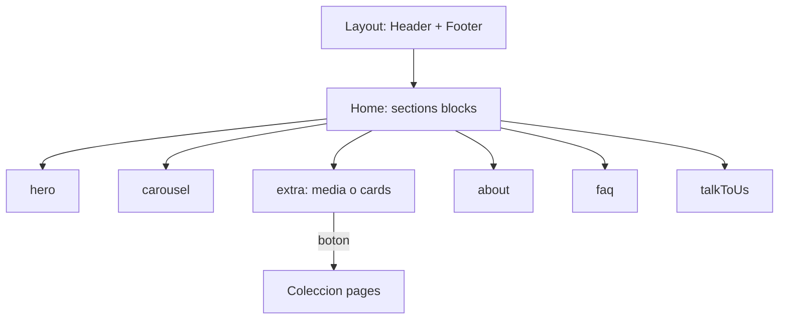

# Home por bloques, Páginas y extras

El home deja de mezclar Hero fijo en `app/(frontend)/[locale]/page.tsx` + bloques sueltos. Todo el cuerpo es un solo campo `sections` en Sitio, para poder intercalar extras entre las fijas.

Header y Footer siguen en `app/(frontend)/[locale]/layout.tsx` (no son bloques).

## I. Sección extra (al pulsar Add)

Sustituir `globals/section-blocks.ts`: quitar `oferta`, `valor`, `confianza`, `nosotros`, `faqCierre`, `extra` actual.

Un bloque `extra` con:

- Título + checkbox visible
- `layout`: `media` | `cards` (`admin.condition` para mostrar un formato u otro)

**a. Media:** imagen (visible, align left/right) + subtítulo (visible) + texto (visible) + botón (visible, texto + relación a `pages`)

**b. Tarjetas:** array `cards[]` con imagen (visible, align left/center/right) + subtítulo + texto + footer + botón (mismos campos de enlace)

Botón: `relationship` a `pages` (no URL suelta). Si no hay página, no se pinta el enlace.

## II. Colección Páginas

Nueva `collections/Pages.ts`, registrada en `payload.config.ts` (aparece sola en el menú admin).

Campos: `title` (localized), `slug` (único), `body` (rich text lexical), `_status` drafts.

Ruta pública: `/{locale}/paginas/[slug]` — evita choque con `ofertas`, `productos`, `privacidad`, `aviso`.

Leer con el mismo patrón que productos (`lib/cms.ts`).

## III y IV. Cinco bloques fijos + seed

Bloques especializados (cada uno con `visible` y su contenido):

| Bloque | Contenido |
|---|---|
| `hero` | campos del tab Hero actual |
| `carousel` | título/lead del carrusel de ofertas (datos siguen en Ofertas) |
| `about` | título, texto, imagen |
| `faq` | título + preguntas |
| `talkToUs` | título, texto, botón (mailto a `contactEmail` por defecto) |

Quitar el tab **Hero** de `globals/Site.ts`: esos campos viven en el bloque `hero`. Tabs Identidad / Apariencia / Navegación se quedan.

**Seed:** si `sections` está vacío o solo tiene tipos viejos (`oferta`, `valor`, `confianza`, `nosotros`, `faqCierre`), escribir el default:

1. hero 2. carousel 3. about 4. faq 5. talkToUs

Valor y Confianza no se migran. Copy actual de About/FAQ/CTA/Hero se copia a los bloques nuevos.

## Front

- `components/HomeSections.tsx`: pintar hero, carousel, about, faq, talk, extra (dos layouts + alineación).
- `page.tsx`: solo `HomeSections`.
- CSS para `img-left` / `img-right` / `img-center` y grid de tarjetas.
- Página de detalle de Páginas.

## Esquema Postgres (Docker)

`CI=true` deja `push: false`. Crear tablas: `pages` + `site_blocks_hero|carousel|about|faq|talk_to_us|extra` y arrays/locales. Luego seed.

No rename de tablas viejas (`site_blocks_oferta`, etc.).
