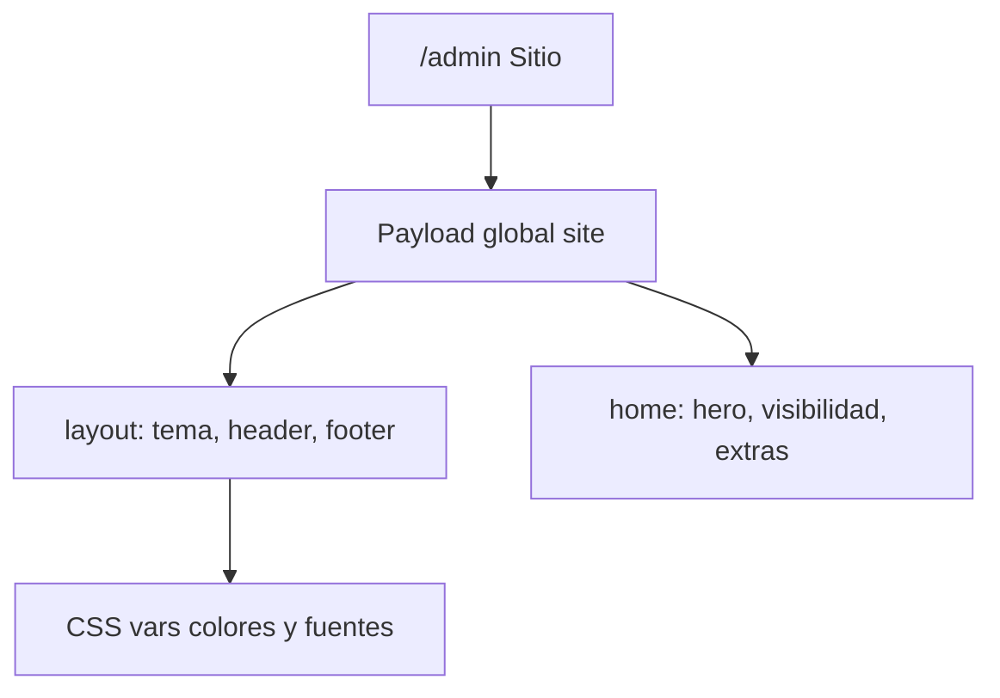

# Configurar todo el sitio desde /admin

Hoy el global [`globals/Site.ts`](/home/miguel/proyectos/catalogo-web/globals/Site.ts) cubre textos e imágenes de secciones fijas. El menú, logo, colores, fuentes y visibilidad están en código ([`components/Header.tsx`](/home/miguel/proyectos/catalogo-web/components/Header.tsx), [`app/(frontend)/[locale]/layout.tsx`](/home/miguel/proyectos/catalogo-web/app/(frontend)/[locale]/layout.tsx), [`app/globals.css`](/home/miguel/proyectos/catalogo-web/app/globals.css)).

Se amplía **Sitio** (no una colección nueva). Las secciones actuales se quedan; al final se pueden añadir las que se quieran.

## 1. Campos nuevos en Sitio

Pestañas del global (campos no required, defaults en seed / `siteCopy`):

**Identidad**
- `logo` (upload media)
- `logoText` (texto localizado; si vacío, usa `name`)
- `showLogo`, `showLogoText`, `showMark` (checkboxes, default true)

**Apariencia**
- `colorPrimary`, `colorSecondary` (text, hex; default `#cc9999` y `#0099ff`)
- `fontPrimary`, `fontSecondary` (select: Open Sans, Lato, Montserrat, Playfair Display, Source Serif 4, Nunito)
- Aplicación: `--color-rose` / `--color-sky` / `--color-rose-deep` (primario oscurecido en código) y `--font-sans` / `--font-display` en `<html>` desde el layout. Fuentes vía `<link>` de Google Fonts (no `next/font` dinámico).

**Navegación**
- `navItems` array: `label` (localizado), `href` (ancla o ruta, ej. `/es#faq`), `visible`
- `navCta` (localizado; hoy está solo en `messages`)
- `showNav`, `showNavCta`, `showLangSwitch`

**Hero** (además de lo que ya hay)
- `showHeroTitle`, `showHeroLead`, `showHeroCta`, `showHeroSearch`, `showHeroImage`

**Visibilidad de secciones fijas**
- `showCarousel`, `showValue`, `showTrust`, `showCases`, `showAbout`, `showFaq`, `showCtaBand`

**Secciones extra** (después de FAQ / CTA)
- Array `extraSections`: `title`, `text`, `image`, `buttonLabel`, `buttonHref`, `visible`
- Se pueden añadir, reordenar y ocultar desde el admin

## 2. Frontend

- [`lib/site-copy.ts`](/home/miguel/proyectos/catalogo-web/lib/site-copy.ts): leer los nuevos campos + visibilidad (default visible si el campo no existe).
- [`app/(frontend)/[locale]/layout.tsx`](/home/miguel/proyectos/catalogo-web/app/(frontend)/[locale]/layout.tsx): inyectar estilo de tema; pasar menú, logo y flags al header/footer.
- [`components/Header.tsx`](/home/miguel/proyectos/catalogo-web/components/Header.tsx) / [`components/Footer.tsx`](/home/miguel/proyectos/catalogo-web/components/Footer.tsx): menú desde CMS; logo imagen o marca; ocultar lo que `show*` indique.
- [`app/(frontend)/[locale]/page.tsx`](/home/miguel/proyectos/catalogo-web/app/(frontend)/[locale]/page.tsx): no renderizar hero pieces / secciones si están ocultas; renderizar `extraSections` visibles.

## 3. Datos existentes

- Checkboxes default `true` para no romper el sitio actual.
- Seed: no reescribir Sitio si ya hay nombre; los extras empiezan vacíos.
- `payload-types` se actualiza al arrancar (push de Postgres en dev).

## Fuera de alcance

- Editor visual drag-and-drop.
- Fuentes arbitrarias (solo la lista del select).
- Cambiar la colección Ofertas (productos, destacados, promo).
