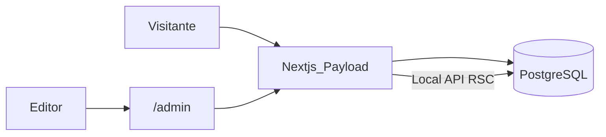

# Catálogo Payload 3 + Next.js (una app)

Workspace: [`/home/miguel/proyectos/catalogo-web`](/home/miguel/proyectos/catalogo-web). Una app, un proceso. PostgreSQL aparte.

**Stack:** Payload CMS 3 + Next.js + PostgreSQL. Catálogo público + `/admin`. Sin API HTTP pública. i18n es/en. Tailwind. Docker/Railway clonados de `node:22-bookworm` + `postgres:16-alpine`.

## Análisis y propuesta de diseño

**Objetivo:** catálogo para vender. Usuario: comprador que llega a ver productos.

**Paleta (elegida):** fondo `#FAFAF9`, texto `#1C1917`, acento `#0EA5E9`. Neo-brutalismo refinado: bordes 2px, sombras offset en cards, mucho blanco. Claridad > decoración.

**Acción en 5s (elegida):** ver el catálogo. Complemento estructural: ficha de producto + cambio de idioma (i18n). Sin carrito ni checkout en v1.

**Estructura (por qué):**

- **Header sticky:** nombre + ancla a catálogo + switcher `ES | EN`. El producto se ve en <5s; el idioma no se esconde.
- **Hero corto:** titular + CTA “Ver catálogo” que hace scroll a la grilla. No hay segundo fold de marketing.
- **Grilla de productos:** imagen, nombre, precio. Cards con hover (escala + sombra) y `:focus-visible`.
- **Ficha `/[locale]/productos/[slug]`:** imagen, nombre, precio, descripción.
- **Footer:** idiomas + copyright.
- **`/admin`:** fuera de i18n de rutas (Payload).

Tipografía: **Figtree** (UI) + **Fraunces** (titulares), Google Fonts `display=swap` + preload. Escala modular ~1.25, `rem`/`clamp()`. Mobile-first. WCAG AA sobre esa paleta.

El front **no llama HTTP**. Lee DB con Local API:

```ts
const payload = await getPayload({ config })
await payload.find({ collection: 'products', locale, where: { _status: { equals: 'published' } } })
```

Payload **sí necesita** `/api/*` interno para que `/admin` funcione. Se desactiva GraphQL. El catálogo público no usa REST.



## Stack y origen Docker

No se bajan imágenes nuevas. Se **duplican** las de [`planificador-eventos`](/home/miguel/proyectos/planificador-eventos) y [`analisis-mercado`](/home/miguel/proyectos/analisis-mercado) con **nombres nuevos**:

- App: `FROM node:22-bookworm` (mismo que `Dockerfile` / `Dockerfile.dev` de planificador)
- DB: `postgres:16-alpine` + `pull_policy: never` (como analisis-mercado)
- npm + `package-lock.json` (mismo patrón que planificador, no pnpm)

Contenedores nuevos: `catalogo-web-postgres`, `catalogo-web-app`. Volúmenes propios (`catalogo_web_pgdata`). No se reutilizan volúmenes de otros proyectos.

## Estructura de archivos

```
app/
  (frontend)/
    [locale]/layout.tsx
    [locale]/page.tsx                 # hero + grilla
    [locale]/productos/[slug]/page.tsx
  (payload)/
    admin/[[...segments]]/page.tsx
    api/[...slug]/route.ts            # solo admin
collections/Users.ts Media.ts Products.ts
globals/Site.ts
messages/es.json en.json              # UI chrome
payload.config.ts
middleware.ts                         # /es /en; excluye /admin y /api
Dockerfile / Dockerfile.dev
docker-compose.yml
railway.toml
```

Locales: `es` (default) y `en`. Middleware reescribe `/` → `/es`.

## Payload

- DB: `@payloadcms/db-postgres` + `DATABASE_URL`
- `localization: { locales: ['es','en'], defaultLocale: 'es', fallback: true }`
- `graphQL: { disable: true }`
- **Products:** `title`, `slug`, `description` (localized); `price`, `image` (no localized); drafts
- **Media**, **Users** (admin)
- **Site** global: `heroTitle`, `heroCta` localized
- Primera visita a `/admin` crea el usuario (flujo nativo Payload)

Scaffold: `create-payload-app` blank + Postgres **dentro** del repo vacío, luego se recorta REST público y se añade el front custom (no template `website`: trae demo de más).

Next en rango compatible con Payload (15.4.x o 16.2.6+). `output: 'standalone'` para el Dockerfile.

## Docker local (duplicado de planificador)

[`docker-compose.yml`](/home/miguel/proyectos/planificador-eventos/docker-compose.yml) copiado y renombrado:

- `postgres:16-alpine`, `pull_policy: never`, healthcheck `pg_isready`, user/db `catalogo`
- `app` build `Dockerfile.dev` (`FROM node:22-bookworm`), bind-mount, `npm run dev`, `depends_on` healthy
- Sin Adminer (no hace falta para el catálogo)

[`Dockerfile`](/home/miguel/proyectos/planificador-eventos/Dockerfile) adaptado: mismas capas `node:22-bookworm` + openssl; en start, `payload migrate` en vez de Prisma; `next start --hostname 0.0.0.0 --port ${PORT:-3000}`.

## Railway

[`railway.toml`](/home/miguel/proyectos/analisis-mercado/railway.toml) clonado:

- `builder = "DOCKERFILE"`
- healthcheck `/` (o `/es`)
- Addon PostgreSQL → `DATABASE_URL`
- `PAYLOAD_SECRET`, `PAYLOAD_PUBLIC_SERVER_URL`

Un servicio web + Postgres. Sin segundo contenedor de API.

## Tareas

1. Scaffold Payload 3 blank + Postgres; desactivar GraphQL; i18n es/en
2. Collections Users, Media, Products (localized) + global Site
3. Rutas `[locale]`, middleware, messages es/en, Local API en RSC
4. Header, hero, grilla, ficha; paleta FAFAF9/1C1917/0EA5E9; a11y y rem
5. Duplicar `node:22-bookworm` + `postgres:16-alpine` en contenedores `catalogo-web-*`
6. `railway.toml` + env + migrate on start (standalone)

## Fuera de v1

Carrito, WhatsApp, filtros, auth de clientes, REST público.
